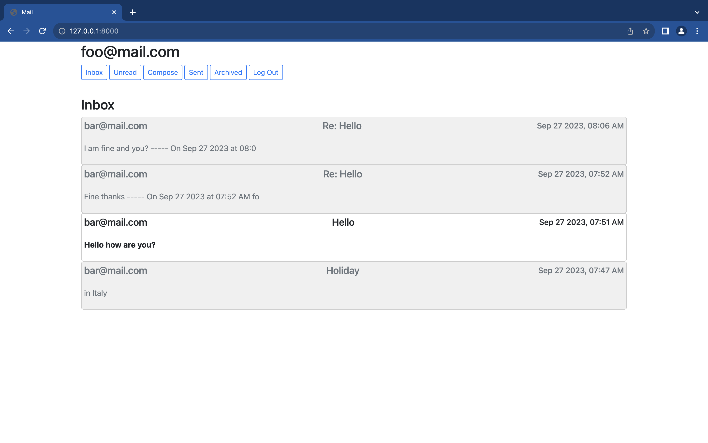
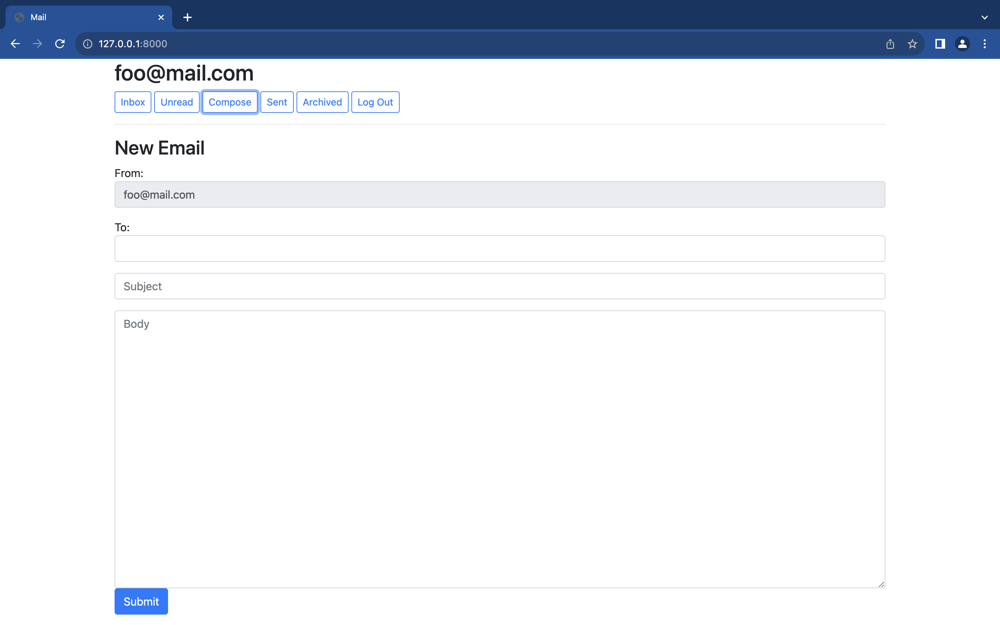
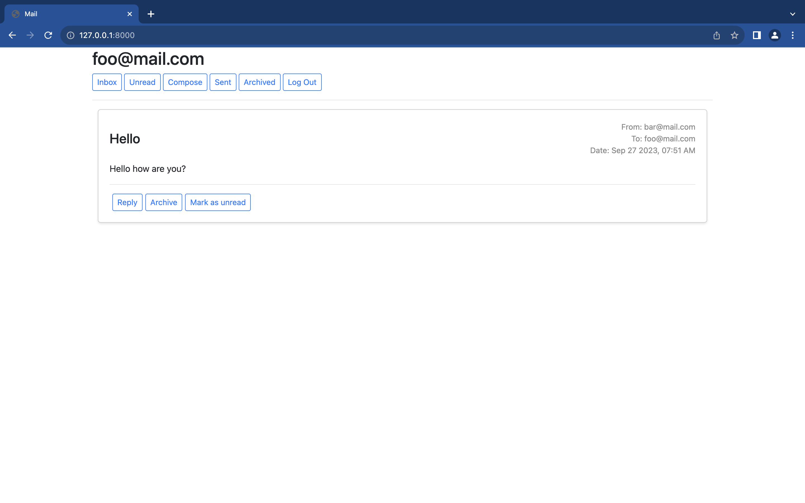
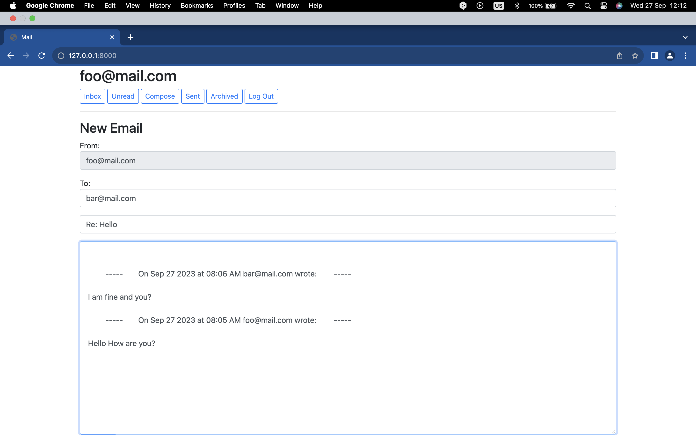

# CS50W-Project 3: Mail
Design a front-end for an email client that makes API calls to send and receive emails.

### [VIDEO DEMO](https://youtu.be/DnzqOEVJb-s)

## Skills
* Javascript
* DOM
* Single-page app
* Django
* Python

## Screenshots

### Inbox

### Send Mail

### View Email

### Reply

